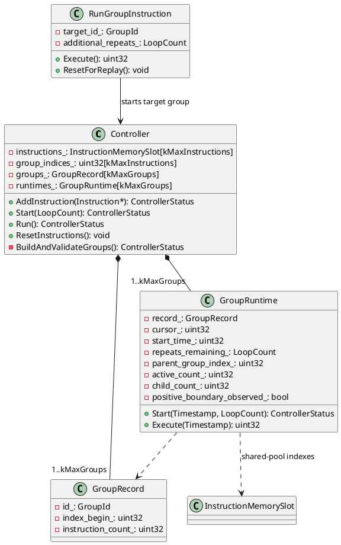

# Instruction Groups

[ctrl-hdr]: ../../../include/prism/controller.hpp
[ctrl-src]: ../../../app/controller/controller.cpp
[command-sink]: ../../../app/src/hw/controller_command_sink.cpp
[command-msg]: ../../../app/src/hw/controller_command.hpp
[app-task]: ../../../app/src/blink_app.cpp
[app-hdr]: ../../../app/include/app/app.hpp
[protocol-tags]: ../../../protocol/include/tags.hpp
[protocol-api]: ../../../protocol/include/protocol.hpp
[protocol-readme]: ../../../protocol/readme.md
[hw-task]: ../../../app/src/hw/hw_task.cpp
[timed-note]: timed_instruction_extension.md
[architecture]: ../../../docs/architecture.md
[board-overlay]: ../../../boards/seeeduino_xiao.overlay

## Goal

Use group IDs to bind instructions into timelines. `Controller::Start`
initializes the global group (ID 0); after a successful start, its caller
performs one immediate `Run()` progress tick. A `RunGroup` instruction starts
another group's timeline at a chosen point in its parent. Groups can repeat
without copying their instructions.

This note defines the controller program model, the APP-side command
contract, and the feature-specific wire tags and payload bytes below. It does
not implement timed instructions; those remain separate design work. The
implementation must not add BAL, OSHAL, dynamic-allocation, or
hardware-flashing requirements to the controller core.

## Codebase Fit and Constraints

- `Controller` currently stores at most 16 `InstructionMemorySlot` objects.
  `Mark` is `uint16_t`, while the timestamp callback returns `uint32_t`
  milliseconds [controller API][ctrl-hdr].
- Current marks are offsets from the first `Controller::Run()` call. A run
  drains active instructions before picking newly due instructions, and uses
  the smallest requested delay for its next wake-up [controller source][ctrl-src].
  The new API must separate start initialization, the caller-owned initial
  progress tick, and timer-driven progress.
- `ControllerInstruction::Execute()` already returns 0 when complete or a
  positive delay before it should be called again. The current concrete color
  instructions complete immediately; the example `Delay` below is illustrative
  and depends on the timed-instruction behavior described in the
  [timed-instruction note][timed-note].
- The command path currently carries no `GroupId`, has no `RunGroup` command,
  and dispatches both the external `kRun` command and timer callbacks through
  `Controller::Run()` [command sink][command-sink] [command message][command-msg]
  [APP task][app-task] and [APP header][app-hdr]. APP setup also starts its
  default program with `Run()` directly. The later APP migration must call
  `Start` for each program start (including setup and external `kRun`), then
  call `Run()` once immediately only after a successful `Start`; timer
  wake-ups continue to call `Run()`. Keep that migration out of the
  controller-runtime step.
- The current protocol has six controller-command tags and a built-in
  loopback handler. Its handler table is currently eight entries, so it
  cannot hold the twelve controller tags required by this feature plus
  loopback. Step 3 raises the fixed table capacity to exactly 13 and checks
  every registration [protocol API][protocol-api]
  [protocol tags][protocol-tags].
  `ControllerCommandSink::Register` currently ignores the `AddHandler` result
  and `HwTask::Setup` continues after registration [command sink][command-sink]
  [HW task][hw-task]; Step 3 makes failure visible through setup.
  The feature-specific wire allocation and compatibility rules are frozen
  below; no protocol version negotiation is added.
- This is APP behavior. It should not add a BAL or OSHAL dependency; the
  project architecture places controller behavior in APP
  [architecture][architecture]. The selected board integration is
  [Seeeduino XIAO][board-overlay].

## Proposed Behavior

### Public Types, Status, and Program Lifecycle

- Define `GroupId` as `uint32_t`. Group IDs are labels, not indexes, and the
  value 0 is reserved for the implicit root group.
- Define `LoopCount` as `uint16_t`. `0` means one pass, values through
  `0xFFFE` mean that many additional passes, and `0xFFFF` is the forever
  sentinel. Only the root start policy may use the sentinel; a nonzero group
  rejects it as an invalid program or command.
- Keep the controller contract platform-neutral by defining a Prism-owned
  `ControllerStatus` rather than including an OSHAL status header. At minimum
  it reports success, invalid argument, busy/program-locked, capacity
  exhausted, invalid program, and an already-active group. `AddInstruction`,
  `Start`, and `Run` return this status; `ResetInstructions` remains an
  explicit abort-and-clear operation. The existing invalid-program status
  also covers a repeated-boundary invariant violation detected at runtime; do
  not add a separate status for that defensive failure.
- The controller has three observable states: editable/idle, active, and
  completed with a retained program. `AddInstruction` is accepted only while
  editable/idle. A completed program is replayable but locked until
  `ResetInstructions`, which prevents accidental mutation between replays.
- `Start(root_additional_repeats)` validates the complete retained program
  before changing runtime state. A validation failure leaves the program
  intact and the controller idle. An empty root program is a successful
  no-op that immediately becomes completed.
- `Run()` is a progress tick. When idle or completed it is a harmless no-op,
  so a stale timer after reset cannot execute cleared instructions. While
  active, it captures one current timestamp and advances all active group
  runtimes against that timestamp.
- Runtime failures that occur during a tick, such as a duplicate active group
  call, are latched as the first non-success status for that tick, returned by
  the tick, and written to the configured debug sink. The repeated-boundary
  runtime guard uses this same latch and falls back to the existing
  `ControllerStatus::kInvalidProgram` only when no earlier runtime failure is
  latched; it does not add a status value. A failed group call is consumed and
  does not reset or disturb the already-active invocation. A future protocol
  status/response frame is outside this design; the one-way APP path must at
  least log a non-success controller result instead of silently discarding it.

### Group Identity and Membership

- Each stored instruction belongs to exactly one group and keeps its existing
  `Mark`. The group membership is part of the instruction's stored
  configuration and defaults to group 0.
- A group has no separate scheduled `Mark`. The mark on a `RunGroup`
  instruction schedules the child activation on the parent's timeline.
- Group 0 starts with the controller run. A `RunGroup` targets a nonzero group
  that has instructions in the loaded program.
- Load the complete instruction set before starting. Reset aborts all active
  runtimes and clears the program; a completed run retains its program for
  replay until reset.

### Time and Repetition

- The root group's local time starts at the timestamp captured by
  `Controller::Start`. Each instruction mark is an offset from its owning
  group's local start time. A single timestamp sample is shared by every
  group during one `Run()` tick so equal-time decisions are deterministic.
- When a `RunGroup(target, additional_repeats)` instruction becomes due, it
  starts the target at the current timestamp. The target's mark 0 is due
  immediately; its other marks are offsets from that activation.
- A repeat starts a fresh local timeline at the time the previous pass and its
  outstanding timed instructions or child calls complete. Repeats are
  completion-relative, not fixed-period scheduling.
- A repeat count means additional passes: 0 is one pass, and N is one initial
  pass plus N repeats. The root repeat count is a controller start policy;
  each `RunGroup` carries its own finite additional-repeat count.
- Static preflight accepts a group with one or more repeats only when it has
  a statically identifiable positive scheduling boundary (a future mark, a
  timed-instruction deadline, or a child boundary). A one-pass zero-time group
  remains valid; a repeated group with no such boundary, including a forever
  root program, is rejected before execution. The timed-instruction contract
  must expose enough static capability information for this preflight check.
  At runtime, static capability alone does not count as an observed boundary
  when deciding whether to start another pass.
- Use unsigned timestamp subtraction for elapsed time. The implementation
  assumes no single local timeline remains unresolved across more than half
  the `uint32_t` timestamp range; marks remain bounded by their `uint16_t`
  representation. Tests must cover the intended wrap boundary.

### Concurrent Parent and Child Timelines

- A parent continues its own timeline while a child is active. A `RunGroup`
  instruction remains in progress until its child and descendants complete,
  but does not block other due parent instructions.
- A group pass completes only when its own pending instructions, active timed
  instructions, and launched child calls are complete. The controller run
  completes when group 0 and all successfully launched descendants complete;
  a rejected `RunGroup` attempt does not create outstanding child work.
- The root remains active through successfully launched child work, even when
  a repeated child activation has ended defensively; starts while that work
  remains are still rejected as busy.
- Track whether each current pass has actually observed a positive scheduling
  boundary in fixed runtime state. A positive mark is observed only when its
  instruction becomes due after group-local time advances. A timed boundary
  is observed only when the timed instruction that yielded a positive
  deadline resumes at or after that deadline. When a child or deeper
  descendant observes a boundary, propagate the observation to all currently
  active ancestors in that launched-call chain through the fixed parent
  runtime links. Clear the per-pass state at every repeat restart; static
  preflight information alone does not set it.
- Nested `RunGroup` calls are allowed, but the loaded group-call graph must be
  acyclic. At most one invocation of a given nonzero group may be active; a
  second activation while it is active is rejected without disturbing the
  first. Different groups may be active concurrently.
- A rejected `RunGroup` call completes as a failed instruction and leaves its
  parent timeline eligible to continue. The parent pass still remains
  outstanding only for child calls that were successfully launched. An
  already-active target contributes neither an outstanding child nor its
  boundary to the rejected call's parent. The failed call's own positive
  `RunGroup` mark still counts if that instruction became due after positive
  local time.
- For equal-time work, resume active timed/group work before selecting newly due
  instructions. Preserve instruction insertion order for equal marks within a
  group. This matches the current controller order and the example below.
- Schedule the next controller tick for the earliest due mark or timed-work
  deadline across all active groups.

### Controller Lifecycle

The API needs to distinguish a new run from a progress tick. Today both the
protocol `Run` command and the schedule timer call `Controller::Run()`. The
contract is:

- `Start(root_additional_repeats)` validates and initializes the root
  invocation, capturing its fresh local-time origin without executing any
  instruction. A start while active is rejected; a new start after completion
  replays the retained program with a fresh root timestamp.
- After every successful `Start`, the caller performs one immediate `Run()`
  call as the initial progress tick. `Run()` advances an active run only; it
  never implicitly starts an editable program. Calls while idle or completed
  are harmless no-ops, including the initial tick for an empty root.
- Later timer callbacks also call `Run()` for progress. `ResetInstructions()`
  aborts all active groups, clears the program, and returns the controller to
  idle; a stale timer tick after reset must be a no-op.
- The APP task must check and log non-success results from `Start` and `Run`.
  Protocol handlers reject malformed payload lengths before enqueueing a
  command, and mailbox-send failure is reported through the existing debug
  path rather than creating a partial instruction.

### APP Command Contract

- Existing color tags remain group-0 commands. Preserve the current
  permissive length behavior of all legacy tags: the four color handlers keep
  their minimum-length checks and ignore trailing bytes, while legacy reset
  and `kRun` retain their current ignored-length behavior. Do not reinterpret
  or extend any legacy payload. In particular, legacy `kRun` means
  `Start(0)`, followed by exactly one immediate `Run()` only if `Start`
  succeeds.
- The APP side constructs a `RunGroupInstruction` in the specified parent
  group; the command does not execute the child directly. The controller's
  `RunGroupPayload` remains an internal configuration type, not a wire
  struct. Multi-byte wire fields are serialized field-by-field in
  little-endian order; do not serialize native C++ struct layout or padding.
- These feature tags and payloads are the exact Step 3 wire contract:

  | Command | Tag | Wire payload, in field order | Length |
  | --- | ---: | --- | ---: |
  | Grouped RGB range | `0x0107` | `mark:u16, r:u8, g:u8, b:u8, start:u8, end:u8, group_id:u32` | 11 B |
  | Grouped RGB single | `0x0108` | `mark:u16, r:u8, g:u8, b:u8, index:u8, group_id:u32` | 10 B |
  | Grouped HSV single | `0x0109` | `mark:u16, h:u8, s:u8, v:u8, index:u8, group_id:u32` | 10 B |
  | Grouped HSV range | `0x010A` | `mark:u16, h:u8, s:u8, v:u8, start:u8, end:u8, group_id:u32` | 11 B |
  | `RunGroup` | `0x010B` | `parent_group_id:u32, mark:u16, target_group_id:u32, additional_repeats:u16` | 12 B |
  | `Start` | `0x010C` | `root_additional_repeats:u16` | 2 B |

  Each `u16`/`u32` is little-endian. The listed sequence is the packed wire
  sequence, independent of native alignment. New tags require the exact
  listed payload length; reject both short and overlong payloads before
  reading fields or enqueueing a command. Do not reuse removed tag `0x0104`.
  There is no version negotiation: senders that need groups or root repeat
  policy use the new tags.
- `RunGroup` carries its parent `GroupId`, activation `Mark`, target
  `GroupId`, and finite additional-repeat `LoopCount`; the child forever
  sentinel remains invalid. The new `Start` command carries the root
  additional-repeat policy, including `0xFFFF` for forever. APP setup's
  default program starts with `Start(0)`. Both setup and external start
  commands call `Run()` once immediately only after a successful `Start`;
  timer callbacks continue to call `Run()` as progress ticks.
- `AppTask::UpdateInstructions()` enqueues only when the controller accepts the
  program mutation. Its `kRun`/start case calls `Start`; the one-shot timer
  continues to call `Run`. Both paths check the returned status and emit a
  debug diagnostic on failure. The command sink must report mailbox-send
  failures through the existing debug path and must not create partial
  instructions.

#### Protocol Registration Capacity and Failure

- The six existing controller handlers plus these six new handlers require
  twelve application registrations. The built-in `kLoopback` handler already
  occupies one slot, so set `protocol::kMaxHandlers` to 13 inclusive of
  loopback. This is the minimum capacity for this feature; leave no implied
  spare slot and do not count loopback as an application command.
- `ControllerCommandSink::Register` returns `bool`, checks every
  `Protocol::AddHandler` result, and returns false on the first failure; a
  failed or duplicate registration must not be silently ignored.
  `HwTask::Setup` checks that result, logs failure through the existing debug
  port, and fails setup rather than entering the frame-processing loop with a
  partially registered command set. Do not add a new error framework or
  protocol response for this initialization failure.

## Worked Timeline

The example uses one additional repeat for group 1, so it runs twice total.
`Delay(100)` is a timed instruction: its first execution waits 100 ms and its
next execution completes.

| Index | Instruction and arguments | Mark | Group |
| --- | --- | ---: | ---: |
| 0 | `SetLed(r, 0)` | 100 | 0 |
| 1 | `SetLed(b, 0)` | 200 | 0 |
| 2 | `SetLed(y, 1)` | 0 | 1 |
| 3 | `SetLed(g, 1)` | 100 | 1 |
| 4 | `Delay(100)` | 100 | 1 |
| 5 | `RunGroup(target=1, additional_repeats=1)` | 300 | 0 |
| 6 | `SetLed(r, 0)` | 500 | 0 |

Times below are milliseconds from the root start:

| Time | Behavior |
| ---: | --- |
| 0 | `Start` captures group 0's origin; its caller immediately ticks `Run()`. No root instruction is due yet. |
| 100 | Instruction 0 sets LED 0 to red. |
| 200 | Instruction 1 sets LED 0 to blue. |
| 300 | Instruction 5 starts group 1. Its mark-0 instruction runs immediately. |
| 400 | Group 1 runs its mark-100 instructions; the delay yields for 100 ms. |
| 500 | The delay completes. Group 1 starts its one repeat at a fresh origin and runs instruction 2. Group 0's instruction 6 is also due and runs after active child work. |
| 600 | Group 1 runs its mark-100 instructions and starts the delay again. |
| 700 | The delay and group 1 complete. Group 0 and the controller run complete. |

If the root repeat policy requests another pass, group 0 starts that pass at
completion time 700 ms after all child work has finished.

## Bounded Implementation Shape

Keep one fixed instruction pool and build compact, non-owning group views when
the program starts. A shared index pool avoids reserving a full instruction
list in every group. Group IDs are looked up in a compact table, never used as
direct indexes.

With N = `kMaxInstructions`, every non-root group must contain at least one
stored instruction. Set `kMaxGroups = N + 1` to include the implicit root;
with today's N = 16, that is at most 17 group records. The number of groups
cannot grow independently of the fixed instruction capacity.



The diagram shows ownership boundaries, not a frozen public API. `RunGroup`
must be added to the instruction storage/dispatch variant. `GroupRecord` is
immutable metadata built at start; `GroupRuntime` is reset for each invocation
and owns the cursor, local origin, repeat count, outstanding child count, and
per-pass observed-boundary flag. The flag is cleared on every repeat restart.
The controller keeps one fixed active-instruction record per stored slot, so
timed instructions and `RunGroup` calls share the `kMaxInstructions` bound.
Group runtimes are advanced iteratively; nested calls do not use the C++ call
stack. The example's stateful `Delay` also needs a reset/replay contract before
group repeats can reuse its slot.

## Alternatives and Trade-offs

- **Copy instructions into every group:** simple local queues, but duplicates
  the fixed instruction pool and can make RAM scale with groups times
  instructions. The shared pool and index views are preferred.
- **Block the parent until a child returns:** simpler scheduling and fewer
  active states, but contradicts the 500 ms parent instruction in the worked
  timeline. Concurrent timelines are selected.
- **Use recursive C++ calls for nested groups:** mirrors the call graph but
  keeps child execution on the call stack and complicates timer-driven
  resumption. Acyclic group IDs with fixed iterator state keep stack use
  bounded.
- **Put a mark on the group definition:** makes reusable group activation
  timing ambiguous. The `RunGroup` instruction's own mark is the activation
  schedule, so group definitions remain labels over instructions.

## Edge Cases and Failure Behavior

- Validate that every `RunGroup` target exists, is nonzero, and has
  instructions; reject call-graph cycles before starting.
- Reject a second active invocation of the same group without resetting or
  advancing the existing one. Consume the failed call, return/latch the
  already-active status, and continue the unaffected parent and child
  runtimes. The rejected activation does not increment the parent's child
  count or import the active target's boundary.
- Before starting another pass of a repeated activation, require an observed
  positive boundary in the pass that just completed. If none was observed,
  end that activation instead of restarting it. Preserve any earlier
  non-success already latched for that `Run()` tick (for example,
  `kAlreadyActiveGroup`); if there is no earlier runtime failure, latch and
  return the existing `ControllerStatus::kInvalidProgram` so the violated
  preflight invariant is visible. Complete parent bookkeeping for the
  stopped activation normally, decrementing the outstanding count of its
  successful launcher; an already-active target and other unrelated or
  successfully launched work continue unaffected. The parent/root remains
  active until its successfully launched outstanding children complete.
- Reject instruction-capacity overflow and group-table overflow. `AddInstruction`
  must not silently drop an instruction; it returns the capacity status and
  leaves the existing program unchanged.
- Reject null instruction pointers, group ID 0 as a `RunGroup` target, forever
  child repeats, and mutation while active or after completion. A caller must
  reset before loading a replacement program.
- `ResetInstructions()` must stop all active iterators. Since the existing
  schedule callback only arms a timeout, either cancel the timer or ensure a
  stale timeout cannot restart/advance a cleared program.
- Before each repeat, reset per-instruction execution state as well as the
  group's cursor and time origin. Current color instructions are stateless;
  timed instructions may not be.
- The instruction lifecycle needs a replay hook or equivalent state split:
  configuration is copied into the fixed slot, while transient execution state
  is reset at every group activation. A stateful instruction must never carry
  completion state from a previous pass.
- Preserve stable order for instructions sharing a mark. At a shared timestamp
  between active child work and newly due parent work, process active work
  first, matching `DrainExecuting()` before `PickNewInstructions()`.
- If due work remains after active work completes at the same timestamp, keep
  draining it in the same tick until no work is due. Static preflight rejects
  repeated groups without a declared positive boundary, and the runtime
  observation guard prevents a statically admitted pass from starting another
  pass without actually observing one. A one-pass zero-time program remains
  bounded by the fixed instruction pool.
- Use unsigned timestamp subtraction for each group's elapsed time. Marks are
  currently 16-bit, so each local instruction horizon is bounded by that
  representation; timed-operation duration and timestamp-wrap assumptions
  still need tests.
- A finite child repeat count is allowed; an infinite child count is invalid.
  Only the controller's root repeat policy may select forever.
- An empty non-root group is invalid because it cannot provide a completion
  boundary. An empty root is valid and completes immediately.

## Resource and Scaling Impact

Capacity-specific items below are calculated bounds from the current
16-instruction capacity. The Step 4 target-build storage measurements are
recorded separately below:

- A 32-bit group ID stored with each of 16 instructions represents 64 bytes of
  group-ID scalar data before object/union alignment. The actual RAM delta must
  be measured with `sizeof` and the target link map.
- A shared array of 16 32-bit instruction indexes is another calculated
  64-byte pool. By comparison, 17 groups each reserving 16 32-bit indexes
  would use 1,088 bytes; the shared pool avoids this O(groups x instructions)
  reservation. Group-record and group-runtime state, including one fixed
  observed-boundary flag per runtime, scales with the number of groups, at
  most N + 1 under the fixed capacity; the actual object sizes and padding
  must be measured.
- One fixed active-instruction record is needed for each stored slot at most.
  Its group association, next deadline, and execution-state bookkeeping are
  O(N) RAM. Because repeated zero-time groups are rejected, due work at one
  timestamp remains bounded by the fixed instruction pool. Do not replace
  these arrays with a heap-backed list.
- The command mailbox has 20 fixed-size entries [command message][command-msg].
  The largest new wire payload is 12 bytes (`RunGroup`), but this is not the
  native mailbox-message size: grouped command payloads, the command enum,
  and union alignment determine the actual fixed entry size. Measure
  `sizeof(ControllerCommandMessage)` and the mailbox's backing storage before
  and after Step 3; do not infer the RAM delta from wire lengths.
- Protocol handler capacity grows from 8 entries to 13, inclusive of the
  built-in loopback handler. This is a calculated increase of five fixed
  handler entries (`5 * sizeof(HandlerEntry)`); measure the resulting
  `sizeof(protocol::Protocol)` and target static-RAM/map delta because
  pointer size and alignment are target/compiler-dependent. Twelve command
  registrations exactly fill the remaining entries, with no spare handler
  slot.
- Group lookup and graph validation are bounded by the loaded instruction and
  group counts. With N = 16, a linear compact-table lookup and an O(N^2)
  build/sort are bounded and avoid dynamic allocation. Per-tick cost scales
  with active groups and due/in-flight instructions. Boundary propagation
  adds an active-ancestor walk per observed event, bounded by `kMaxGroups`;
  include it in the bounded per-tick operation analysis, not as a tick-duration
  or WCET result. LED-range instruction work remains the likely larger cost.
- Step 4's documented Seeeduino XIAO/SAMD21 baseline and candidate builds
  report FLASH usage of 175,276 B and 178,496 B (+3,220 B), and RAM usage of
  29,984 B and 30,288 B (+304 B), respectively. The linker maps show `.bss`
  growing from 0x2AC6 to 0x2BF2 (+300 B); the first `.noinit` address moves
  from 0x20003A58 to 0x20003B88 (+304 B) because the gap after `.bss` grows
  from 2 to 6 B. These are storage results only: no target tick-duration
  metric or WCET has been measured. Before raising instruction/group
  capacities, remeasure target storage and resolve the separate target-timing
  decision described under Unresolved Decisions.

## Design Decisions

- **Repeat representation:** `LoopCount` is `uint16_t`; `0xFFFF` is forever
  only for the root start policy, and `0xFFFE` is the largest finite
  additional-repeat count.
- **Failure visibility:** controller mutations and progress ticks return a
  Prism-owned `ControllerStatus`. Runtime group conflicts and defensive
  repeated-boundary failures do not cancel unrelated timelines; they are
  returned/latched for the detecting tick and logged by APP.
- **Program ownership:** loading is explicit and fixed-capacity. A completed
  program is replayable but immutable until `ResetInstructions`; reset is the
  only replacement boundary.
- **Activation policy:** one runtime invocation per nonzero group is allowed.
  The group-call graph is validated as acyclic before the first start, and
  nested execution is iterative rather than recursive.
- **Protocol compatibility:** the exact tags and wire payloads in the APP
  Command Contract are approved. Legacy colors remain group 0 and retain
  their current permissive length behavior; legacy `kRun` retains its
  ignored-length behavior and maps to `Start(0)` plus one success-gated
  immediate progress tick. New commands use tags `0x0107`-`0x010C`, require
  exact lengths, and are decoded field-by-field as little-endian values.
  There is no version negotiation, and removed tag `0x0104` stays unused.
- **Zero-time repetition:** any root or child repeat count greater than zero
  requires a statically identifiable positive scheduling boundary. A single
  zero-time pass is allowed. Before another pass starts, runtime must observe
  a positive boundary; if the static preflight claim was not realized, stop
  that activation and preserve an earlier tick failure or use existing
  `kInvalidProgram`. No new status or same-timestamp dispatch budget is needed.

## Development and Validation Steps

### 1. Define the Bounded Program Model

**Goal and scope:** Add instruction group membership, a `RunGroup` payload,
compact group records, the Prism-owned status contract, replay reset hooks, and
pre-run validation. Keep all instructions, group indexes, and runtime records
in fixed-capacity storage.

**Prerequisites:** The decisions in this note and the existing
`ControllerInstruction`/`InstructionMemorySlot` ownership model.

**Completion criteria:** Sparse `GroupId` values work; group 0 is implicit;
valid targets are found without indexing by ID; empty/missing targets, cycles,
and capacity overflow fail before execution; adding while active or after
completion is rejected; replay state is reset at every activation; all
capacity/mutation failures return a non-success status.

**Focused validation and resource risk:** Host tests cover zero/root ID,
sparse IDs, maximum instruction/group counts, missing targets, cycles, and
mutation while active or after completion. Record
`sizeof(InstructionMemorySlot)`, group records, runtime records, active
records, and mailbox entries to confirm the calculated RAM bounds.

### 2. Implement GroupRuntime, Timelines, and Lifecycle

**Goal and scope:** Implement the controller runtime over Step 1's fixed
program model: explicit start/initial-tick lifecycle; group-local marks and
deadlines; root and child repeats; nested asynchronous `RunGroup` execution;
outstanding-work completion; and reset/replay behavior. Keep this step to the
controller core/API and host controller tests. Retain fixed-capacity storage
and `ControllerStatus`. `RunGroupPayload` is controller configuration, not a
wire payload; do not change APP dispatch, mailbox messages, protocol tags, or
wire serialization in this step.

**Prerequisites:** Step 1's bounded program representation, `ControllerStatus`,
replay hooks, and pre-run validation, plus the timed-instruction
yield/replay/static-boundary contract. A test timed instruction may exercise
the existing `Execute()` contract if no concrete timed instruction is
available; protocol and APP integration are not prerequisites.

**Completion criteria:**

- `Start()` validates and initializes a fresh root invocation and captures its
  time origin, but executes no instructions. The caller owns one immediate
  `Run()` call after each successful start, including when an empty root makes
  that tick a no-op. `Run()` never implicitly starts an editable program;
  idle/completed calls are harmless, starts while active fail, completed
  programs can be replayed from a fresh origin, and reset aborts outstanding
  work so stale ticks cannot revive it.
- Each group uses its activation timestamp as its local origin. A child starts
  at its parent's `RunGroup` activation time, making child mark 0 due
  immediately. One timestamp sample governs all group work in a tick. Timed
  instructions retain per-instruction deadlines and are not resumed early
  merely because another group's deadline or mark caused a tick. The next
  wake-up is the earliest pending mark or timed-instruction deadline across
  active groups; preserve insertion order for equal marks and resume already
  active timed/group work before selecting newly due work at equal times.
- A parent continues its own due work while children execute, but its
  `RunGroup` calls remain outstanding until their children and descendants
  complete. A group pass and the root run complete only after that group's
  pending instructions, active timed instructions, and all launched child
  calls complete. Root and child repeats are completion-relative, start with
  fresh local origins, and mean one initial pass plus the requested additional
  passes. A repeated root must not start its next pass or report completion
  while child work from the prior pass is still outstanding.
- Preserve the active-invocation conflict policy: a second activation of an
  already-active non-root group is consumed as a failed call, reports/latches
  the first non-success `ControllerStatus` for that tick, and does not reset
  or disturb the existing invocation. The parent and other active groups
  continue; successfully launched children remain part of the parent's
  outstanding work.
- Maintain a fixed per-pass observed-boundary state, clear it on every
  restart, and propagate observations to active ancestors. Count a positive
  mark only when its instruction becomes due after local time advances; count
  a timed boundary only when the instruction that yielded its positive
  deadline resumes at or after that deadline. Static preflight alone is not a
  runtime observation.
- A failed `RunGroup` activation for an already-active target launches no
  child, adds no outstanding-child count, and contributes no target boundary;
  its own positive mark still counts if due after positive local time. If a
  repeated pass ends without an observed boundary before another pass would
  start, stop that activation and preserve an earlier tick failure such as
  `kAlreadyActiveGroup`, or otherwise report existing `kInvalidProgram`;
  document this `Run()` result using the existing status rather than adding
  an enum. Update the public status/API comments so `kInvalidProgram` also
  documents this defensive runtime use.
  Release the stopped activation's successful parent relationship normally,
  without disturbing B's first activation or other successful work; root stays
  active until successfully launched children finish.
- Preserve repeat-boundary validation: child repeats are finite, only the
  root may use the forever sentinel, and every repeated group needs a static
  positive boundary. Positive boundaries propagate from nested descendants.
  A root whose only positive boundary is in a child or deeper descendant
  passes preflight, waits for that child chain to finish, and only then starts
  its next root pass at the completion time. Drain newly due work at that same
  timestamp until none remains; the runtime observation guard prevents a
  repeated group from restarting at that timestamp without an observed
  boundary.

**Focused validation and resource risk:** Add host controller tests using the
fake clock and a timed test instruction. Verify `Run()` on a loaded-but-editable
program is a no-op; `Start()` executes no work before the caller's immediate
`Run()`; and cover the empty, active-start, replay, reset, and stale-tick
lifecycle. Test finite/forever root policies, finite child repeats (N means
N+1 passes), rejection of the child forever sentinel, and per-pass instruction
state reset. Reproduce the worked timeline at 100, 200, 300, 400, 500, 600,
and 700 ms; confirm parent progress during child execution, nested outstanding
completion, and fresh repeat origins. Exercise local mark origins, child
mark-0 activation, stable same-time ordering, no early timed resume, earliest
deadline selection across groups, timestamp wrap within the documented
half-range assumption, and active-target conflicts without disturbing the
first invocation. Also verify that a failed `RunGroup` at a positive mark
counts that mark only after it becomes due on an advanced local timeline.
Retain the Step 1 regression
`NestedChildBoundaryPropagatesToRepeatedRoot` in `tests/controller_test.cpp`
and add runtime coverage proving that the child-only boundary delays a
repeated root until the full child chain completes. Add Auron's conflict
scenario: repeated A passes static preflight through B's positive boundary,
but A's mark-0 `RunGroup(B)` fails because the first B activation is still
active. Verify A ends without another pass, the detecting tick preserves
`kAlreadyActiveGroup`, the failed call adds no outstanding child and does not
propagate B's boundary, B and other successfully launched work continue, and
starts remain busy until that work completes. Also exercise a separate
no-prior-error path with a test instruction that advertises a positive static
boundary but completes without yielding; the guard must return existing
`kInvalidProgram` and stop before another pass. Retain preflight coverage
for zero-time repeats and status failures. Run the documented
`uv run unit-tests` check; keep scheduling iterative and heap-free, and record
bounded tick work and `sizeof` changes at the current 16-instruction limit.
Use the existing `cid-design-step` workflow for this bounded implementation
and review checkpoint; no new skill is warranted.

### 3. Integrate the Command and Wire Path

**Goal and scope:** Implement the approved wire contract in this note across
protocol tags/handler capacity, command-sink decoding, mailbox messages, and
APP dispatch. Add the six new tags and commands without changing legacy wire
interpretation; migrate setup and external starts to `Start` plus the
success-gated initial `Run()` tick, while keeping timer callbacks on `Run()`.
Update the handler-capacity constant in the generic
[protocol README][protocol-readme] so it matches the implementation; this
feature note remains the exact tag/payload authority. Keep scope to this
command path and its tests.

**Prerequisites:** Steps 1-2 and the settled wire contract, compatibility
rules, handler capacity, and registration-failure behavior in the APP
Command Contract above. No separate protocol-design decision or version
negotiation is a prerequisite.

**Completion criteria:**

- Register all six legacy and six new controller handlers alongside the
  built-in loopback handler with `kMaxHandlers = 13`; no slot is reserved as
  spare. Check every `AddHandler` result. `ControllerCommandSink::Register`
  returns failure to `HwTask::Setup`, which logs and fails setup rather than
  running with partial registration.
- Decode new payloads field-by-field in the listed order and endianness,
  preserving `GroupId`, parent/target IDs, marks, and repeat counts through
  mailbox delivery and APP construction. Require exact new-tag lengths before
  enqueueing; preserve each legacy handler's present permissive length
  behavior. Keep `0x0104` unassigned and add no version negotiation.
- Map the legacy `kRun` frame to `Start(0)`; the APP performs one immediate
  `Run()` only on successful `Start`. The new `Start` tag passes its
  `root_additional_repeats` value, including `0xFFFF`. `RunGroup` creates one
  controller instruction in its parent group with finite repeats. Setup's
  default program also uses `Start(0)` and its success-gated initial tick;
  timer events remain progress-only `Run()` calls.
- APP reports non-success controller statuses; the command sink reports
  mailbox-send failures; HW setup reports protocol registration failure and
  aborts startup. Use the existing debug/startup paths. No response frame or
  new error subsystem is added.

**Focused validation and resource risk:** Host tests exercise every new tag's
exact length (short and overlong rejection), field order and little-endian
decoding, group-0 legacy behavior, legacy minimum-length rejection and
extra-byte acceptance plus existing ignored-length behavior, legacy `kRun`
mapping, new `Start` repeat values,
`RunGroup` routing, and malformed commands not reaching the mailbox. Verify
that all twelve sink registrations plus loopback succeed at capacity 13 and
that the next registration fails; a forced duplicate/full-table registration
failure is surfaced through `Register` and aborts HW setup. Test the APP's
successful-`Start` immediate tick versus timer-driven `Run()` behavior and
mailbox capacity/failure path.

The largest new wire payload is 12 B, well below the existing 256 B frame
data limit. **Calculated capacity delta:** raising the handler table from 8
to 13 adds five fixed handler entries; measure `sizeof(protocol::Protocol)`
and the target static-RAM/map change rather than assuming pointer width or
padding. The mailbox remains 20 entries; measure
`sizeof(ControllerCommandMessage)` and its fixed backing storage before/after,
since native union alignment may exceed the wire-field sizes. Record bounded
RAM/flash impact from target `sizeof` and linker-map results, and describe
dispatch only in terms of fixed-capacity operation bounds. Do not report host
timings or static work bounds as a target tick-duration result or WCET.
Measuring target tick duration is not required for Step 3 and remains
separately deferred under Step 4. No hardware execution or flash is required
for this verification.

### 4. Verify and Measure the Integrated Feature

**Goal and scope:** Run the project-owned host tests, format/lint checks, and
target build after Steps 1-3. Confirm the implementation remains within the
fixed storage and scheduling bounds.

**Prerequisites:** Steps 1-3 and initialized project dependencies.

**Completion criteria:** The controller and protocol host suites pass; changed
C/C++ files pass the repository format and lint wrappers; the target build
passes without editing imported trees; and the target linker map and `sizeof`
measurements record static RAM and flash impact. Confirm the fixed
`kMaxGroups = kMaxInstructions + 1` capacity. Do not flash or run hardware as
part of this step. Actual target tick-duration measurement is deferred until
separate explicit authorization for any required hardware execution or flash
and agreement on a target measurement method and workload.

**Focused validation and resource risk:** Use the documented project wrappers
from the Prism Kit root: `uv run unit-tests`, `uv run format --check`,
`uv run lint`, and `uv run build --skip-lint`. Record target `sizeof` values
and linked static RAM/flash deltas against the baseline. Do not report host
timing or static work bounds as a substitute for the target tick-duration
metric or as WCET. No target timing result is required for this verification
step; its measurement remains deferred as described above. Use the existing
workspace `unit-tests`, `format`, `lint`, and `build` workflows; do not create
a new workflow skill.

### 5. Add Rainbow3 and Safe Smoke Cleanup (Final Step)

**Goal and scope:** Add a `rainbow3` host command and route the smoke test's
rainbow phase through it, using the grouped commands and root-start wire
contract already defined above. Add protocol frame builders/constants and
standard-library host tests as needed. Keep all changes on the host side:
`scripts/rainbow3.py`, `scripts/modules/protocol.py`,
`scripts/smoke_test.py`, `pyproject.toml`, and the new
`scripts/tests/test_rainbow3.py`. Do not change `scripts/rainbow2.py`, its
`rainbow2` entry point or behavior, or target firmware in this step.

Rainbow3 clears the queued program, programs the same seven-color palette as
Rainbow2 with device-side marks, clears the full LED range one interval after
the last palette LED, and starts the root with exactly `Start(0xFFFF)`:

1. Send `ResetInstructions`.
2. Send one grouped RGB range for group 0, mark 0, black, half-open range
   `[0, 7)`.
3. Send seven grouped RGB singles in palette order, all in group 0, with
   `mark = index * step_delay_ms`.
4. Send a second grouped RGB range (tag `0x0107`) for group 0, black,
   half-open range `[0, 7)`, with `mark = 7 * step_delay_ms`. This matches
   the initial black range apart from its mark; it clears the seven LEDs one
   interval after the last palette single at index 6.
5. Send the new `Start` command (tag `0x010C`) with root additional repeats
   `0xFFFF` (wire payload `FF FF`). Do not send the legacy `kRun` frame.

The grouped range and single payloads use the exact `0x0107` and `0x0108`
layouts in the APP Command Contract; their group IDs are little-endian zero.
The command is installed as the `rainbow3` project entry point. Its
`--step-delay` defaults to 200 ms. Accept only `1..9362` ms, validating in
the callable sequence path before opening a serial port as well as rejecting
invalid CLI values. Validate smoke's `--rainbow-step-delay` in argument
handling too, before port discovery or console capture can open any serial
port. The final clear is the latest mark and must fit `uint16_t`:
`7 * 9362 = 65534` fits, while `7 * 9363 = 65541` does not.

Keep smoke's `--skip-rainbow` behavior. Change its
`--rainbow-step-delay` default to 200 ms and forward the selected value to
Rainbow3. After a successful program write, observe one predicted first pass
through the final clear for
`max(1.0, 7 * delay / 1000.0 + 0.5)` seconds, then attempt a
`ResetInstructions` write in cleanup. Attempt that cleanup even when Rainbow3
reports a partial program-write failure; a cleanup exception or short write
makes the rainbow smoke phase fail. If programming fails, do not wait for a
pass, but still attempt cleanup. `--skip-rainbow` bypasses the complete
rainbow phase, including programming, wait, and cleanup.

Reset aborts and clears the controller program but leaves current LED pixels
unchanged. The protocol is one-way and has no acknowledgment: a successful
host write is not proof that the controller accepted the reset or that the
predicted pass ran. If cleanup cannot be written after a partial program, the
smoke phase fails and the controller's resulting program/pixel state is
unknown.

**Prerequisites:** Steps 1-4, especially the Step 3 grouped RGB and Start
handlers, the exact tag/payload table above, and Step 4's integrated
verification. No target-firmware change, live device, new test dependency, or
new test harness is a prerequisite.

**Acceptance criteria:**

- `rainbow3` is a separate project entry point with a 200 ms default and
  `1..9362` ms delay validation before its serial port is opened; smoke rejects
  an invalid `--rainbow-step-delay` before opening any port.
  Rainbow2's source, command, and behavior remain unchanged.
- The outgoing sequence is reset, initial grouped black range, seven grouped
  color singles at index-scaled marks, final grouped black range at
  `7 * step_delay_ms`, then `Start(0xFFFF)`; all instruction commands target
  group 0. Both black ranges encode black, `[0, 7)`, and group 0; the final
  range differs from the initial one only in its mark. At the 200 ms default,
  its exact payload is
  `78 05 00 00 00 00 07 00 00 00 00` (mark 1400, little-endian). No legacy
  `kRun` frame is emitted.
- Smoke defaults to 200 ms, forwards `--rainbow-step-delay`, preserves
  `--skip-rainbow`, observes through the final clear using
  `max(1.0, 7 * delay / 1000.0 + 0.5)`, and attempts reset cleanup after
  success or partial programming failure.
  Cleanup write failure makes the phase fail; cleanup does not claim that
  LEDs were turned off or that reset was acknowledged.
- The default smoke rainbow phase routes through Rainbow3 rather than
  Rainbow2; skipping the phase does not invoke either sequence or cleanup.
- Offline tests prove all eleven outgoing program-frame positions and exact
  payload bytes, including both black ranges and the final range's
  `7 * step_delay_ms` mark; they also check little-endian fields and
  checksums, absence of legacy `kRun`, acceptance of delays `1` and `9362`,
  rejection of out-of-range delays before serial open, and smoke
  default/override routing, the full-pass wait through the clear,
  cleanup-on-failure, cleanup-write failure, and skip behavior.

**Completion criteria:** Register `rainbow3` without altering the existing
Rainbow2 entry point. Keep frame construction and smoke orchestration
independently testable with fake serial/time objects; use only Python's
standard-library `unittest` for the new tests. The focused test module is
`scripts/tests/test_rainbow3.py`, run from the Prism Kit root with:

```text
uv run python -m unittest discover -s scripts/tests -p test_rainbow3.py
```

The existing `uv run unit-tests` wrapper remains the CMake/GTest workflow;
do not extend it or add a Python test dependency/harness for this step. Run
`uv run lint-python` for Python linting. No live-target smoke run, flashing,
or hardware validation is part of completion.

**Focused validation and resource risk:** Fake-serial tests check every
frame's order, exact encoded payload, and XOR checksum; verify eleven program
frames in order (reset, initial grouped range, seven grouped singles, final
grouped range, Start), both exact black-range payloads, the final clear mark
at `7 * step_delay_ms`, the `Start` tag/payload, and that no frame uses the
legacy `kRun` tag. Test delay values at both accepted bounds (`1` and `9362`)
and invalid values outside them, and assert that invalid calls open no serial
port. Fake smoke orchestration checks the 200 ms parser default, rejection
of an invalid override before any smoke port opens, explicit
`--rainbow-step-delay` forwarding, the wait through the final clear
(`2.25` seconds at a 250 ms step; no more than `66.034` seconds at the
maximum delay), cleanup after a failed/partial program write, failure on
cleanup exception or short write, and `--skip-rainbow` bypass without
opening a rainbow command port. Tests must not connect to a live target.

**Calculated host traffic:** The program writes eleven frames: one reset,
two 11-byte grouped range payloads, seven 10-byte grouped singles, and one
2-byte Start payload. Including the six-byte frame overhead, this is
`6 + 17 + 7 * 16 + 17 + 8 = 160` protocol bytes, excluding serial-line
framing. The successful smoke phase's cleanup reset adds one 6-byte frame,
for 166 bytes total. The work is bounded by eleven program writes plus one
cleanup write. The wait through the final clear is bounded by the accepted
delay range; at 9362 ms it is at most 66.034 s. These are calculated bounds,
not measured target timings. This step adds no controller firmware code or
target storage; no new target RAM/flash or controller tick cost is expected.
The one-way protocol and failure to write cleanup remain operational risks,
not costs that a host test can eliminate.

## Unresolved Decisions

### Blocking

- None for Steps 1-5. Step 5 uses the settled Step 3 protocol tags, payload
  layouts, compatibility policy, handler-table capacity, and
  registration-failure behavior above.

### Non-blocking

- Before raising instruction or group capacities, remeasure target RAM and
  flash impact. A target tick-duration result is a separate future user
  decision: explicit authorization for any required hardware execution or
  flash, and agreement on the target measurement method and workload, must
  precede it. It is not required to verify the current feature; no timing
  metric has been measured, and host timing or static work bounds are not
  substitutes.