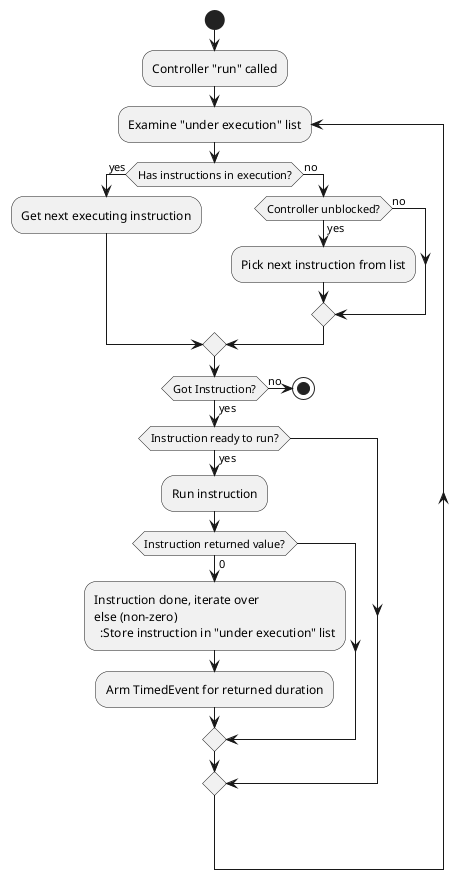

# Controller Time-Bound Instruction Design Plan

[ctrl-hdr]: ../../include/prism/controller.hpp
[timedevt-hdr]: ../../oshal/include/oshal/timed_event.hpp

## Goal

Allow controller [controller.hpp][ctrl-hdr] to handle instructions that run over time, e.g.:

- A delay, halting instruction execution for an amount of time.
- A transition, that changes current LED color to another during a span of time.

## Technical Requirements

- Allow Controller ([controller.hpp][ctrl-hdr]) to disambiguate between "instant" and "timed" instructions. Instant instructions are fully ran upon a call to Execute, timed instructions should save state and yield (return from Execute) with a different value.
  - Perhaps the instruction yields the amount of time must elapse before its next execute call.
  - Instant instructions return 0 (as done, can be discarded).
  - Controller maintains slots to hold instructions under execution.
- An instruction may block the controller from picking up new instructions to execute.
  - This adds a "blocking" characteristic to instructions.
  - The controller doesn't know / care whether an instruction is blocking. The instruction blocks the controller (through a back reference) from picking up new instructions, and unblocks it after its done.
  - Controller instruction execution blocking should be re-entrant (e.g. if two instructions block the controller, the controller must be aware through a count or a list that two call to unblock must be done).
- Amount of instructions "under execution" should be capped by the amount of LEDs of a given script.

## Implementation Details

- Controller holds a TimedEvent [TimedEvent.hpp][timedevt-hdr] where it can tell its owner task when to call "run" again.
- Upon a call to "run", controller verifies the instruction list.
  - If "under execution" array has instructions, attempt to run these.
    - Instruction can have a method "ready-to-run" that tells whether it is ready to run or not.
  - Else if unblocked, pick an instruction to run from the instruction list.
  - If instruction return 0, mark it as done.
    - Done instructions should be kept in case user wants to replay.
  - If instruction return other value:
    - Put the instruction in an "under execution" list / array (can be a reference).
    - Arm a TimedEvent for the amount of time the instruction
- Controller receives a callback ("schedule next run"), where it tells its owner (a Task in the hw implementation, or a mock for unit-tests) when it should be ran next.

