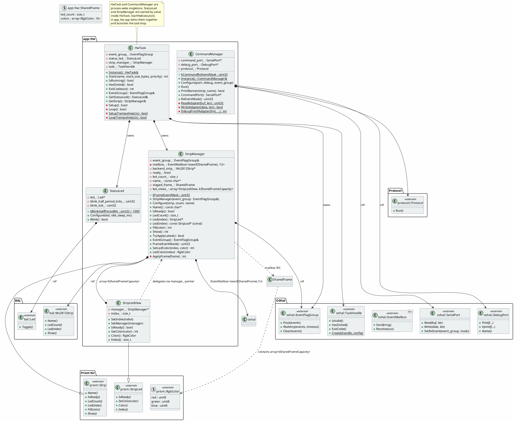

# app/src/hw/ — HW Executor Classes

## Class Diagram



## Construction Order

`HwTask` is a process-wide singleton (`HwTask::Instance()`, defined in
`hw_task.cpp`).  It owns `EventFlagGroup`, `StatusLed`, and `StripManager`
by value.  Construction order is implicit in the member declaration order:

1. `EventFlagGroup event_group_` — constructed first
2. `StatusLed status_led_` — default construction
3. `StripManager strip_manager_{event_group_}` — receives ref to `event_group_`

`CommandManager` is a separate process-wide singleton (`CommandManager::Instance()`,
defined in `command_manager.cpp`).  Its `protocol_` member stores static
adapter function pointers, so no direct reference to the HwTask event group is
needed at construction time.

`StartHwExecutor()` (declared in `hw_coordinator.hpp`, defined in `app_hw.cpp`)
wires everything together and launches the task loop.

## Ownership & Lifecycle

| Instance | Scope | Pattern |
|---|---|---|
| `HwTask` | `hw_task.cpp` anonymous ns | `HwTask::Instance()` |
| `event_group_` | Member of `HwTask` | Owned by value |
| `strip_manager_` | Member of `HwTask` | Owned by value, accessed via `HwTask::GetStrip()` |
| `status_led_` | Member of `HwTask` | Owned by value, accessed via `HwTask::GetStatusLed()` |
| `g_command_manager` | `command_manager.cpp` anonymous ns | `CommandManager::Instance()` |

## Event Flow

```
APP task                              app_hw task
─────────                             ──────────
StripManager::Fill()  ──┐
                        │
StripManager::Show()  ──┤── mailbox_.Send() ──▶ mailbox (posts kFrameEventMask
                        │                       to event_group_ internally)
                        │                       │
                        │              event_group_.WaitAny( frame_mask
                        │                       │          | rx_mask,
                        │                       │          kTaskIdleSleepMs)
                        │                       │
                        │                       ├── TryApplyLatest()
                        │                       │     └── ApplyFrame()
                        │                       │
                        │                       ├── cmd_mgr.Run()
                        │                       │     (only if rx events)
                        │                       │
                        │                       └── status_led_.Blink()
```

## Supporting Files

| File | Purpose |
|------|---------|
| `hw_constants.hpp` | `kTaskIdleSleepMs`, `kTaskStackSizeBytes`, `kTaskPriority` |
| `hw_coordinator.hpp` | Declares `StartHwExecutor()` (defined in `app_hw.cpp`) |
| `shared_frame.hpp` | `kSharedFrameCapacity`, `SharedFrame` struct |
