# app/src/hw/ — HW Executor Classes

## Class Diagram

```plantuml
@startuml
skinparam backgroundColor #FEFEFE
skinparam class {
  BorderColor #2C3E50
  BackgroundColor #ECF0F1
}

' ============================================================
' External types (OSHal, BAL, Protocol, Prism Kit)
' ============================================================

package "OSHal" {
  class oshal::TaskHandle <<external>> {
    + IsValid()
    + HasExited()
    + ExitCode()
    + {static} Create(handle, config)
  }

  class oshal::EventFlagGroup <<external>> {
    + Post(events)
    + WaitAny(events, timeout)
    + Clear(events)
  }

  class oshal::EventMailbox<M,C> <<external>> {
    + Send(msg)
    + Receive(out)
  }

  class oshal::DebugPort <<external>> {
    + {abstract} Printf(...)
    + {abstract} Vprintf(...)
    + {abstract} Name()
  }

  class oshal::SerialPort <<external>> {
    + {abstract} Read(buf, len)
    + {abstract} Write(data, len)
    + SetRxEvent(event_group, mask)
  }
}

package "BAL" {
  class bal::Ws2812Strip <<external>> {
    + {abstract} Name()
    + {abstract} LedCount()
    + {abstract} Led(index)
    + {abstract} Show()
  }

  class bal::Led <<external>> {
    + {abstract} Toggle()
  }
}

package "Protocol" {
  class protocol::Protocol <<external>> {
    + Run()
  }
}

package "Prism Kit" {
  class prism::Strip <<external>> {
    + {abstract} Name()
    + {abstract} IsReady()
    + {abstract} LedCount()
    + {abstract} Led(index)
    + {abstract} Fill(color)
    + {abstract} Show()
  }

  class prism::StripLed <<external>> {
    + {abstract} IsReady()
    + {abstract} SetColor(color)
    + {abstract} Color()
    + {abstract} Index()
  }

  struct prism::RgbColor <<external>> {
    red : uint8
    green : uint8
    blue : uint8
  }
}

' ============================================================
' IPC types
' ============================================================

struct app::hw::SharedFrame {
  led_count : size_t
  colors : array<RgbColor, 16>
}

' ============================================================
' Our classes
' ============================================================

package "app::hw" {

  class HwTask {
    - event_group_ : EventFlagGroup&
    - task_ : TaskHandle
    ..
    + HwTask(EventFlagGroup&)
    + Start(name, setup, loop, ctx, stack, prio) : int
    + IsRunning() : bool
    + HasExited() : bool
    + ExitCode(out) : int
    + {property} EventGroup()
  }

  class StripManager {
    - event_group_ : EventFlagGroup&
    - mailbox_ : EventMailbox<SharedFrame, 1>
    - backend_strip_ : Ws2812Strip*
    - staged_frame_ : SharedFrame
    - led_views_ : array<StripLedView, 16>
    - ready_ : bool
    - led_count_ : size_t
    - name_ : const char*
    ..
    + {static} Instance() : StripManager&
    + Configure(strip, count, name)
    + Name(), IsReady(), LedCount()
    + Led(index) : StripLed*
    + Fill(color), Show() : int
    + TryApplyLatest() : bool
    + {property} EventGroup()
    + {property} FrameEventMask()
    # SetLedColor(index, color) : int
    # LedColor(index) : RgbColor
    - ApplyFrame(frame) : int
  }

  class StripLedView {
    - index_ : size_t
    ..
    + SetIndex(index)
    + IsReady() : bool
    + SetColor(color) : int
    + Color() : RgbColor
    + Index() : size_t
  }

  class StatusLed {
    - led_ : Led*
    - blink_half_period_ticks_ : uint32
    - blink_tick_ : uint32
    ..
    + {static} Instance() : StatusLed&
    + Configure(led, idle_sleep_ms)
    + Blink() : bool
    - {static} kBlinkHalfPeriodMs = 1000
  }

  class CommandManager {
    - command_port_ : SerialPort*
    - debug_port_ : DebugPort*
    - protocol_ : Protocol
    ..
    + {static} Instance() : CommandManager&
    + Configure(port, debug, event_group)
    + Run()
    + PrintBanner(strip_name) : bool
    + {property} CommandPort()
    + {property} RxEventMask()
    - {static} ReadAdapter(...) : uint32
    - {static} WriteAdapter(...) : bool
    - {static} DebugPrintfAdapter(...) : int
  }
}

' ============================================================
' Relationships
' ============================================================

HwTask         *---> oshal::EventFlagGroup : "ref"
HwTask         *---> oshal::TaskHandle

StripManager    ---|> prism::Strip
StripManager    *---> oshal::EventFlagGroup : "ref"
StripManager    *---> oshal::EventMailbox<SharedFrame,1>
StripManager    *---> bal::Ws2812Strip : "ref"
StripManager    *---* StripLedView : "array<16>"
StripLedView     ---|> prism::StripLed
StripLedView     ..> StripManager : "delegates via Instance()"

StatusLed       *---> bal::Led : "ref"

CommandManager  *---> oshal::SerialPort : "ref"
CommandManager  *---> oshal::DebugPort : "ref"
CommandManager  *---> protocol::Protocol

SharedFrame       ..> prism::RgbColor : "contains array<16>"
StripManager      ..> SharedFrame : "mailbox IPC"

' Coordinator
note top of HwTask
  All three singletons (StripManager,
  CommandManager, StatusLed) plus HwTask
  are instantiated in app_hw.cpp with
  controlled construction order.
end note

@enduml
```



## Construction Order

All instances live as file-scope statics in `app_hw.cpp`:

1. **`g_event_group`** — `oshal::EventFlagGroup` (constructed first)
2. **`g_hw_task`** — `HwTask{g_event_group}`
3. **`g_strip_manager`** — `StripManager{g_event_group}`

## Ownership & Lifecycle

| Instance | Scope | Pattern |
|---|---|---|
| `g_hw_task` | `app_hw.cpp` anonymous ns | Plain object |
| `g_strip_manager` | `app_hw.cpp` anonymous ns | `StripManager::Instance()` |
| `g_status_led` | `status_led.cpp` anonymous ns | `StatusLed::Instance()` |
| `g_command_manager` | `command_manager.cpp` anonymous ns | `CommandManager::Instance()` |

## Event Flow

```
APP task                              app_hw task
─────────                             ──────────
StripManager::Fill()  ──┐
                        │
StripManager::Show()  ──┤──mailbox_.Send()──▶ mailbox_.Receive()
                        │                       │
                   event_group_.Post()           ├── ApplyFrame()
                        │                       │
                        └──▶ event_group_.WaitAny()◀── command_port::SetRxEvent()
                                                     │
                                                     cmd_mgr.Run()
                                                     │
                                                     led.Blink()
```
